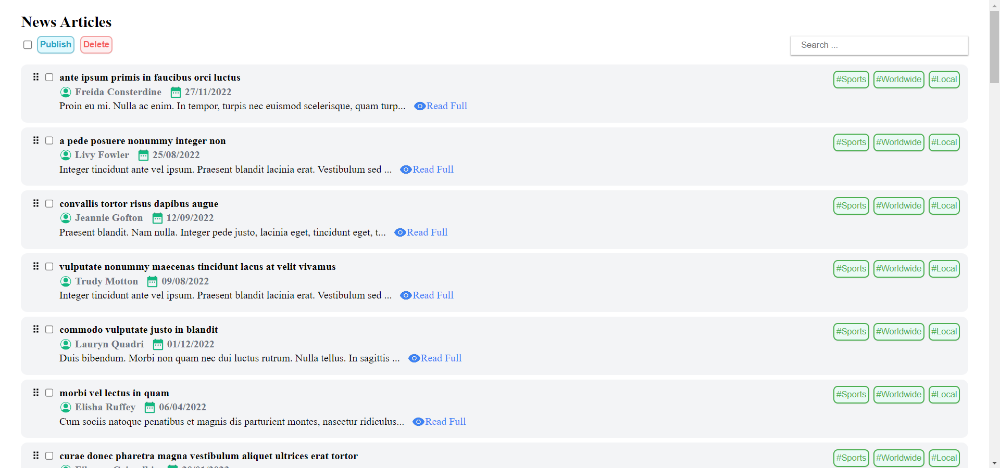

# Nathaniel Flores Enciso-IT(OJT)-Exam 

1. Requirements: 
> Node.js 

2. How to run: 
> Go to the directory of the frontend folder and run the following: 
> - npm install 
> - npm start 

3. Notes:
> - Only the Delete button (including the one in the modal) and the Read Full button are functional   
> - The delete is non-persistent, meaning when refreshing, the original list returns. The reason to keep it non-persistent is so that the testing of simulated behavior is easier (such as deleting all articles, then wanting to delete only specific articles).
> - To make delete persistent, either write to the mock data JSON file or import the JSON file to a database (such as mongoDB) and perform the corresponding queries

4. Screenshots:

